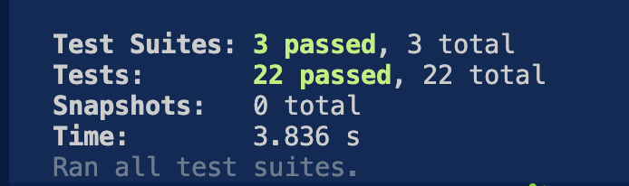
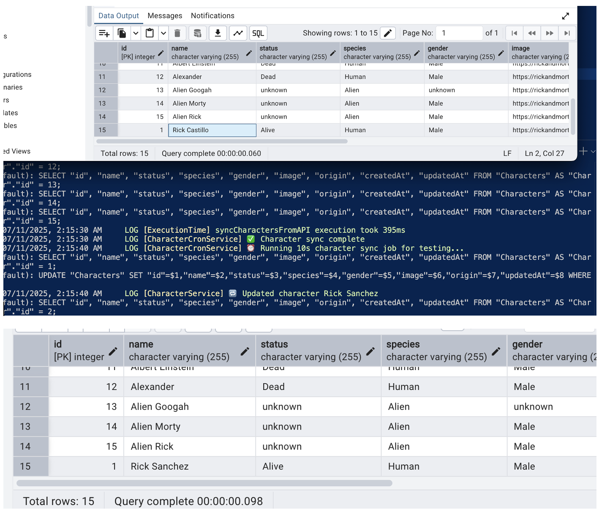
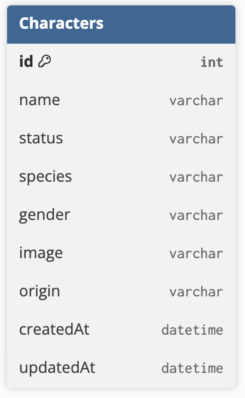

# 🌌 Rick and Morty Character Search API (NestJS + GraphQL)

This project is a backend technical assessment implementing a GraphQL API with Express and PostgreSQL to search and manage Rick and Morty characters. The application also uses Redis for caching and features a cron job to sync external data.

---

## 🚀 Tech Stack

- **NestJS** (built on **Express**)
- **GraphQL** with Apollo Server
- **PostgreSQL** with Sequelize ORM
- **Redis** for caching
- **Docker + Docker Compose**
- **Jest** for unit testing

---

## 📦 Features

### Core

- GraphQL API for querying characters
- Filtering by `name`, `status`, `species`, `gender`, `origin`
- PostgreSQL with real migrations (via `sequelize-cli`)
- Caching search results using Redis
- Logging middleware for every request

### Optional / Bonus

- Decorator `@Timed()` logs execution time of methods
- Cron job every 12h to update characters from the Rick and Morty API
- Unit tests using Jest
- Separation of concerns and dependency injection

---

## 🧪 How to Run

### 1. Clone the repo & setup `.env`

```
DB_HOST=db
DB_PORT=5432
DB_USER=postgres
DB_PASS=postgres
DB_NAME=blossom
REDIS_HOST=redis
REDIS_PORT=6379
```

### 2. Build and start

```bash
docker-compose up --build
```

### 3. Access GraphQL Playground

Visit: [http://localhost:3000/graphql](http://localhost:3000/graphql)

Example query:

```graphql
query {
  characters(filter: { name: "Rick" }) {
    id
    name
    originName
  }
}
```

---

## 🧪 Testing

```bash
npm run test
```

Tests cover:

- Cache hit/miss behavior
- Filtering logic in service layer

---

Test results:


---

## 🕐 Cron Job testing

Cron Job was tested with 10 seconds periodicity to validate registry updating when different data is found:



## 🧠 Development Notes

- The app uses `synchronize: false` and real Sequelize migrations via CLI.
- Migrations are run inside the Docker container using:

```bash
npx sequelize-cli db:migrate
```

- Sequelize CLI is configured via `.sequelizerc`

---

## 📚 Design Decisions

- NestJS is built on **Express**, which supports both REST and GraphQL.
  - I used Apollo Server (via `@nestjs/graphql`) to serve GraphQL over Express.

- Swagger is not used because it is designed for REST APIs. GraphQL APIs include built-in introspection and are documented through tools like GraphQL Playground or Apollo Sandbox.
- Redis cache is key-based using a composite string of the filter input.
  - For example: characters(filter: { name: "Rick" }) would have the key => characters:name:Rick

---

## 📈 Opportunities for Improvement

- Use **webhooks** from the Rick and Morty API to react to changes instead of polling every 12h (not currently supported by the API).
- Add pagination and ordering to character queries.
- Create a proper admin mutation interface (CRUD).

---

## 🧩 ERD



---

## ✅ Assessment Checklist

- [x] Express + GraphQL API
- [x] Sequelize with migrations
- [x] Redis cache
- [x] Middleware logging
- [x] Timed decorator
- [x] Cron job
- [x] Filtering logic
- [x] Dockerized
- [x] Unit tests
